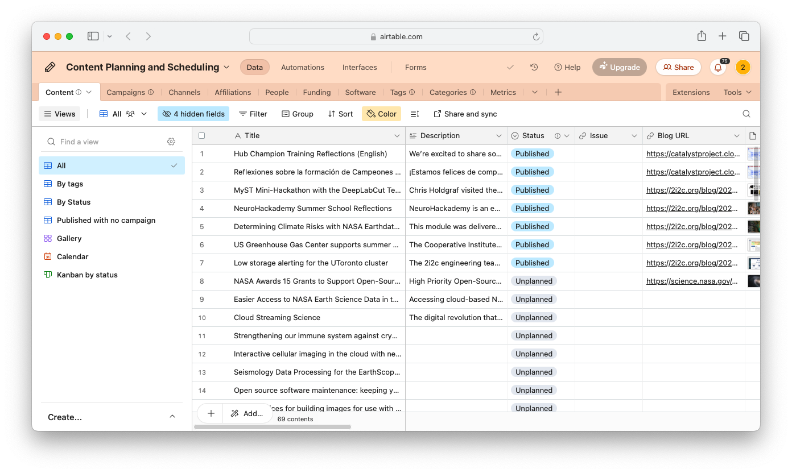

# Blog posts

Our most common form of communication is via [the blog at 2i2c.org/blog](https://2i2c.org/blog).
It is managed by our [Hugo website repository](https://github.com/2i2c-org/2i2c-org.github.io).

(blog:topics)=
## What to post on the blog

Generally speaking, we can post as often as we wish.
Our blog should be a running heartbeat of our organization, and it is OK if the information on there isn't perfect.
Be creative and experiment with formats that you think might be interesting or fun.
If there's something particularly important, we can signal-boost it with our [Mailing list](mailinglist.md).

Here are a few ideas for blog post topics for inspiration:

- **2i2c organizational updates**. Provide updates about important organizational decisions and changes. For example:
  - Major changes to strategy
  - Governance or other organizational changes
  - New hires
- **Major project updates**. For major projects and collaborations, we should provide regular updates about the work that we've done. This shouldn't frame 2i2c as the sole producer for these projects (unless we really are the sole producer), but demonstrate how 2i2c has contributed to the overall effort. For example:
  - Major deliverables that we’ve met on a project
  - New collaborations
- **Open source updates**. If we do particular service work, or make a strong technical improvement in an open source project, we should tell the world about it.
- **Updates from the Managed JupyterHub Serivce**. As hub service infrastructure grows and evolves, and as we serve more communities with it, we should tell others about the impact we are having.
- **Topic dives**. There may be particular topics that we want to write about, like open culture, cloud optimization, etc. These will help us crystallize our thoughts, demonstrate expertise, and share knowledge with others.

## Schedule a blog post with AirTable

We use AirTable for systematically planning content and scheduling blog posts. The workflow is as follows:

1. A member of 2i2c has an idea for content and fills out an AirTable form to schedule a blog post.
1. The communications team reviews the form, then prioritizes and coordinates the work required for publication.
1. The communications team publishes the blog post, and shares it with the community via social media channels where appropriate (see [Social Media](social.md)).

:::{warning}
Do not include sensitive information in the AirTable. Information will become public on our open-source, website GitHub repository when scheduling content.
:::

### AirTable Form

Use the form linked below to schedule new content pieces for [2i2c.org/blog](https://2i2c.org/blog). There is also the option to schedule a social media campaign along with the blog post – see [Social Media](social.md#scheduling-social-media-campaigns-with-airtable) for more details on this workflow.

:::{button-link} https://airtable.com/appM2L2x1uglMU0hy/pagy7CvM0msgqRCcA/form 
:color: primary
Submit Your Content
:::

### Scheduling blog posts

Information collected from the [AirTable form](#airtable-form) is stored in the *Content* table of the [Content Planning and Scheduling](https://airtable.com/appM2L2x1uglMU0hy?ao=cmVjZW50) AirTable base that is used to prioritize content for publication, and coordinate the work for publication using [GitHub issues](https://github.com/2i2c-org/2i2c-org.github.io/issues) in our website repository.

The *Content* table contains the following important fields the the communications team needs to pay attention to:

- Publish Date
- Status
- Social media campaign?

#### Publish Date

A blog post may not initially have a publish date set. The communications team is responsible for using their judgment for scheduling posts based on perceived priority and determining availability of authors where required.

#### Status

There are 4 possible states: {bdg-secondary}`Unplanned` (default), {bdg-primary}`Scheduled`, {bdg-success}`Published` and {bdg-danger}`Cancelled`.

When a blog post is ready to be authored, it should be marked as {bdg-primary}`Scheduled`. This triggers an AirTable automation that opens a [GitHub issue](https://github.com/2i2c-org/2i2c-org.github.io/issues) in our website repository to track work (see [example issue](https://github.com/2i2c-org/2i2c-org.github.io/issues/318)). Once the work is completed, the communications team can mark the item as {bdg-success}`Published`.

:::{figure} images/blog-automated-issue.png
:alt: Automated GitHub issue
An example of an automated GitHub issue triggered from setting the {bdg-primary}`Scheduled` status.
:::

#### Social Media Campaign?

The form includes an option to schedule a social media campaign to promote the blog post. This may initially be left unchecked. If the box is checked and the *Social media campaign date* is specified, then this triggers an AirTable automation to populate the *Campaigns* table. See [Scheduling social media campaigns](social.md#scheduling-social-media-campaigns-with-airtable) for more information.

#### Other fields

The AirTable form is designed to be as low-touch as possible so that the submitter does not need to fill out a lot of information. However, there are some other fields in the *Content* table, such as *Tags*, *Categories*, *People*, *Affiliations* and *Open Source Software*, that the Communications team may want to populate on their behalf based on information provided in the mandatory *Notes* field.